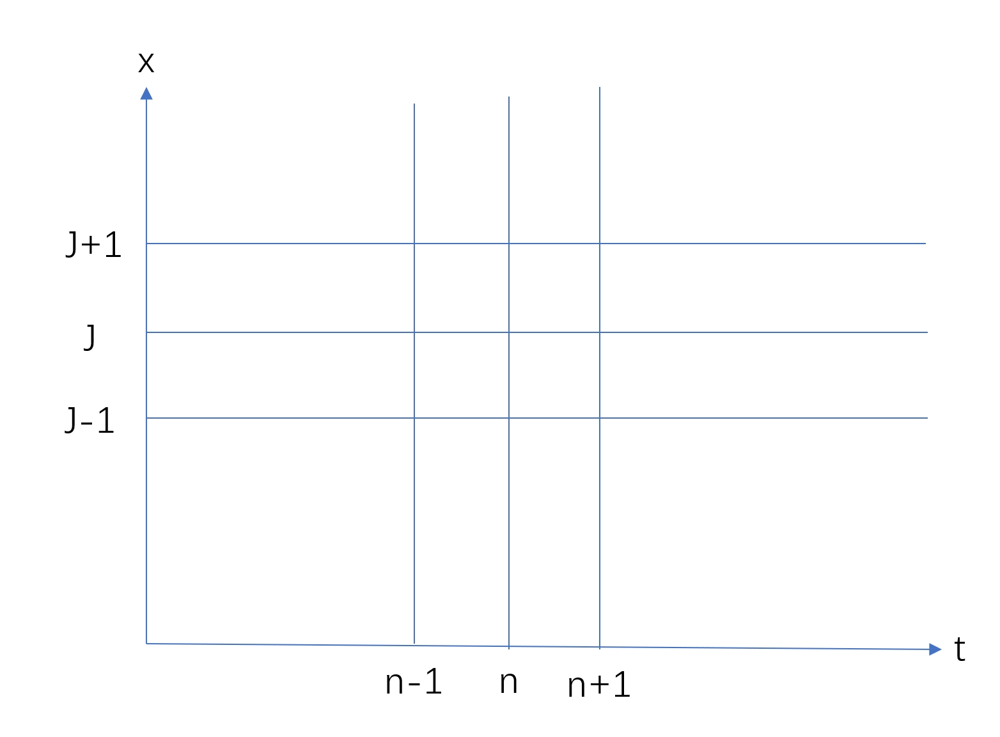
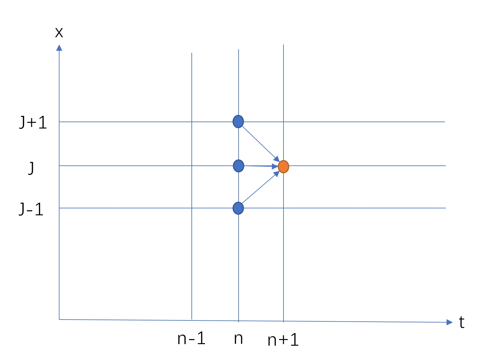
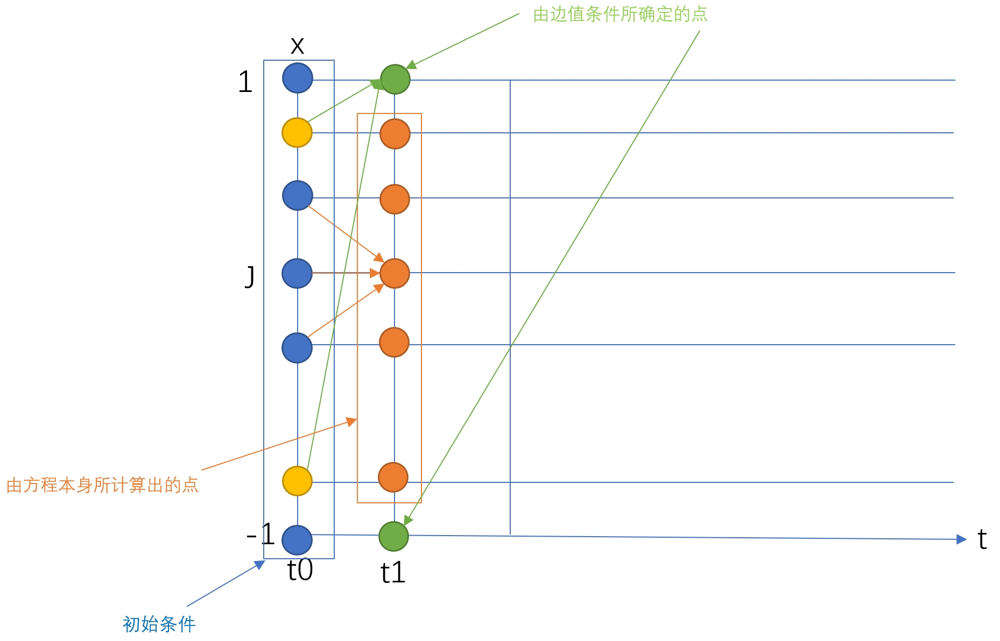
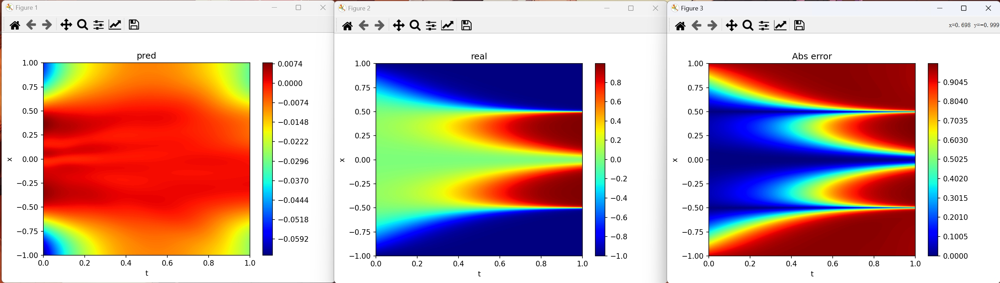
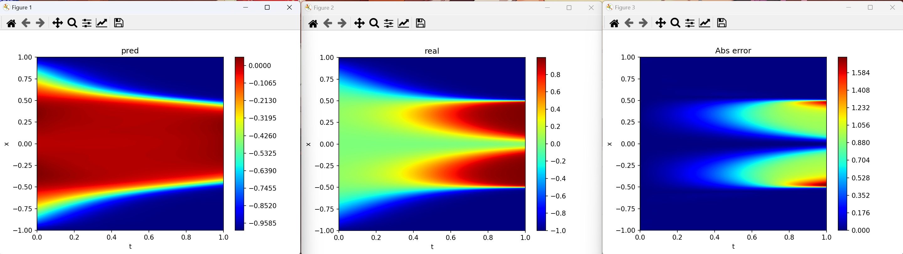
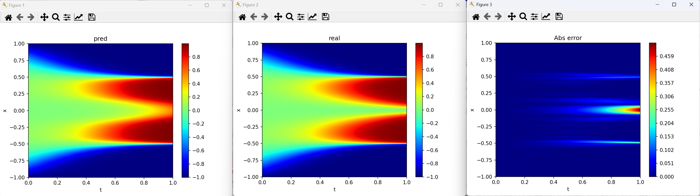
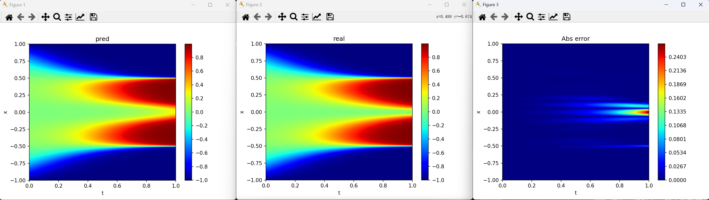
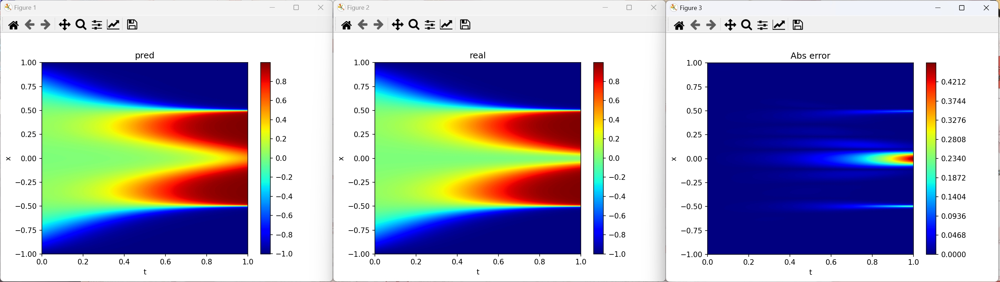

# CICP复现

## 简介

本项目在<[ZzYyPp47/pinn: 一个简易的模块化物理信息神经网络实现(PINN) (github.com)](https://github.com/ZzYyPp47/pinn)>基础上，复现了论文:

>```
>@Article{CiCP-29-930,
>author = {L. Wight , Colby and Zhao , Jia},
>title = {Solving Allen-Cahn and Cahn-Hilliard Equations Using the Adaptive Physics Informed Neural Networks},
>journal = {Communications in Computational Physics},
>year = {2021},
>volume = {29},
>number = {3},
>pages = {930--954},
>issn = {1991-7120},
>doi = {https://doi.org/10.4208/cicp.OA-2020-0086},
>url = {http://global-sci.org/intro/article_detail/cicp/18571.html}
>}
>```

所提出的对PINN性能的五大改进方法。

## 更新

#### 2024.4.2：

修复了loss图的问题，修复了data.mat不匹配的问题,修复了RAR的名称以及错误计算索引的问题，以及一些小bug

## 编译条件

>python 3.12.2
>
>pytorch 2.2 +cu12.1
>
>一点点运气+良好的心态

## 前期准备

我们准备对以下Allen-Cahn方程应用改进方法并进行对比:
$$
\left\{
\begin{aligned}
&u_t - 0.0001u_{xx}+5u^3-5u=0\\
&u(0,x)=x^2\cos(\pi x)\\
&u(t,-1)=u(t,1)\\
&u_x(t,-1)=u_x(t,1)\\
&\Omega \times T=[-1,1]\times[0,1]
\end{aligned}
\right.
$$
首先需要计算出该方程的精确解，来为后续的误差图做准备。这里以$\Delta t,\Delta x$为时空间隔，将时空域网格化，记$x_0=-1,\cdots,x_j=j\Delta x -1,\cdots,x_{N_x}=1$,$t_0=0,\cdots,t_j=j\Delta t,\cdots,t_{N_t}=1$,其中$N_{x}=2/\Delta x$,$N_{t}=1/\Delta t$.这样就得到了如下时空网格:



先将方程离散化，这里对$u_t$向前差分，再对$u_{xx}$做中心二阶差分，$u$​​选取当前时间层，得：
$$
\frac{u^{n+1}_j-u^n_j}{\Delta t}-0.0001\frac{u^{n+1}_j-2u^n_j+u^{n-1}_{j}}{\Delta t}+5(u^n_j)^3-5u^n_j=0
$$
将$u^{n+1}_j$提出，这就可以由当前层的$3$个点推导后一时间层(显式格式),也即
$$
u^{n+1}_j = 
\Delta t\Big[0.0001\frac{u^{n+1}_j-2u^n_j+u^{n-1}_{j}}{(\Delta x)^2}-5(u^n_j)^3+5u^n_j\Big]+u^n_j
$$


下面离散化周期性边界条件,这里等号左边$u_x$向前差分，等号右边$u_x$向后差分
$$
\left\{
\begin{aligned}
&u(t,-1)=u(t,1)\\
&u_x(t,-1)=u_x(t,1)\\
\end{aligned}
\right.
\Rightarrow
\left\{
\begin{aligned}
&u^n_0=u^n_{N_x}\\
&\frac{u^n_{1}-u^n_{0}}{\Delta x}=\frac{u^n_{N_x}-u^n_{N_x -1}}{\Delta x}\\
\end{aligned}
\right.
\Rightarrow
\left\{
\begin{aligned}
&u^n_0=u^n_{N_x}=\frac{u^n_1+u^n_{N_x -1}}{2}\\
&n=0,\cdots,N_t\\
\end{aligned}
\right.
$$
最后结合离散化初始条件
$$
u(0,x)=x^2\cos(\pi x)
\Rightarrow
\left\{
\begin{aligned}
&u^0_j=(u^0_j)^2\cos(\pi u^0_j)\\
&j=0,\cdots,N_{x}
\end{aligned}
\right.
$$
这样就能通过显式差分格式求解出数值解:

详细代码可见` Allen-Cahn.m`

# 改善PINN的方法

## 基础PINN

首先使用最原始的PINN进行计算，详细参数见`base.py`,直接运行`base.py`所得的结果为:



其总的$L_2$​误差为$0.989897540559632$，可以看出，PINN完全没能习得原方程的特征。

## 加权PINN

一种提升PINN解决相场模型能力的技巧是在损失函数中添加权重。这种方法的动机在于相场方程具有耗散性，即它们是不可逆的。例如，Allen-Cahn方程，就像其他反应扩散方程一样，只能在前向时间方向上求解。换句话说，如果PINN未能在时间$t=t_1$时很好地学习解，则在后续时间$t=t_2(t_2>t_1)$精确学习解的希望非常渺茫。为了强调首先学习接近$t=t_1$时刻的解的重要性，我们增加了初始时刻$loss$的权重，以确保神经网络学习出的解满足初始条件。

具体来说，可以如下重新定义损失函数：
$$
\mathcal{L}=\ \mathcal{L}_{pde}+C_0\mathcal{L}_{ini}+\mathcal{L}_{bound}
$$
其中$C_0$是一个可调的大常数。这里，文中选择$C_0=100$，除非另有说明。

直接运行`weight.py`,所得结果为:



可以看出，采用这种策略后，神经网络的表现略有提升，其总的相对$L_2$误差降到了$0.5523627288213634$​，但算法仍未收敛。网络在起始时间域和边界的点上学习到了更好的解，但在后期时空域上(主要是大梯度部分)，学习到的解在随机采样的配点处失去了准确性。

## 小批次训练法

Mini-batching (小批次训练法) 是一种在深度学习中用于提高性能的技术。它不是使用整个数据集来计算梯度，而是使用其中一部分数据(称为小批次)，来计算梯度。与全批量梯度下降相比，小批量处理有助于更好地避免不太理想的局部最小值。

文中指出，在许多PINN相关论文中，作者们并没有在他们的训练过程中使用小批量策略。在本文中，作者研究了小批量处理方法，并观察到小批量方法确实可以促进用于近似相场方程的神经网络的收敛。

**这里复现时保持$C_0=100$，调整架构为$[2,30,30,30,30,30,30,30,30,1]$，$batch\_size = 50$**（原文的参数没做出结果，不知道为什么。）

直接运行`mini.py`,所得结果为:



可以看出，采用这种策略后，神经网络几乎完全学习了精确解，其总的相对$L_2$误差降到了$0.055460177378732094$。网络在绝大部分时空域上学习到了很好的解，但在终了的$x=0$上，学习到的解稍有误差。

## 残差自适应重采样(RAR)

文中提出，在训练过程中，相比于在固定的样本点上进行采样，根据领域变化对采样点进行自适应重采样在某些情况下是至关重要的。特别是对于相场方程，存在着在空间上快速转变的移动界面，这就需要更细的网格来捕捉演化动力学。因此，我们不仅仅在领域内均匀采样点，而是定期停止训练，并重新评估哪些地方最需要采样点。我们注意到，神经网络中误差较大的点与$\mathcal{L}_{pde}$误差较大的点之间存在相关性。这促使我们利用$\mathcal{L}_{pde}$作为重采样的指标。

在实践中，我们首先使用随机选定的点进行网络训练。然后再用拉丁超立方抽样技术选择另一组测试样本点，并选择其中$\mathcal{L}_{pde}$较高的前$200$​​个点。再将这组点加入到之前的配点中，然后再次训练网络。这一过程很重要，因为它防止了我们在整个领域中解的精度丧失，并且，与此同时，帮助我们将更多的点集中到更难以学习的部分。如果必要的话，这个过程可以反复迭代几次，通过添加不同的采样配点集到原始集合中并再次进行训练。

**这里我在复现的时候直接在整个域上选取$\mathcal{L}_{pde}$较高的前$50$个点，同时保持$C_0=100$，并且采用L-BFGS优化器**,直接运行`space.py`，得结果:



可以看出，采用这种策略后，神经网络几乎学习了精确解，其总的相对$L_2$误差降到了$0.02517542242777833$。网络在大部分时空域上学习到了更好的解，但在终了的$x=0$上，学习到的解稍有误差。

## 动态时空训练法

在这种方法的每一个子时空域上，我们将数据点（初始的、边界的和普通的配置点，包括原始的和重新采样的）从特定的子时空域上采样。例如，如果我们在时间域$[0,1]$中近似解，我们从小的时间间隔$[0,t_1]$开始，$t_1>0$，其中$t_1$接近于零，比如$t_1=0.1$。然后我们逐渐增加时间跨度，即$[0,t_i]，i=1,2,\cdots,N$其中$0<t_1<t_2<\cdots<t_N=1$，当神经网络在每个子时空域上充分训练时，我们就认为该神经网络在整个求解域上充分训练。

特别地，人们通常可以设置一个阈值和最大训练迭代次数。一旦损失函数值小于阈值或训练超过最大训练迭代次数，训练过程就进入下一个时间步。在某些情况下，如果损失函数值在最大训练迭代次数后仍然很大，应当减少时间步长。
	此外，动态时空训练法允许用户指定一个时间步骤列表。对于每个时间步骤，只会从这个限定域中采样配置点。在限定的时间间隔内使用自适应空间采样来提高学习效果。然后使用自适应采样配置点对每个时间间隔进行网络训练。

**这里我在复现时保持$C_0=100$不变，调整架构为$[2,30,30,30,30,30,30,30,30,1]$，$\Delta t = 0.01$,每个域采用L-BFGS优化器优化$50$次，没有采用自适应空间采样法。**直接运行`time_I.py`得结果:




可以看出，采用这种策略后，神经网络几乎完全学习了精确解，其总的相对$L_2$误差降到了$0.04990831318486687$。网络在绝大部分时空域上都学习到了相当完美的解，仅在$x=0$​的终了时间段学习到的解略有误差。

这个方法如果参数($Arc=[2,128,128,128,128,128,128,128,128,1]$)调的好，可以更进一步降低误差:


$L_2$误差达到了$0.021206395127375762$

## 子网络时空训练法

与动态时空训练法不同的是，在这种方法中，原先单一的分割时空改为同时分割时空和神经网络：我们为每个子时空域上创建独立的网络。例如，如果我们关注的域是$[0,1]$，设定时间步长$∆t=0.1$。先在域$[0,0.1]$上学习解。一旦这个域上的解学习得很好，就在域$[0.1,0.2]$上训练另一个网络，依此类推，直到解决了整个时空域的问题。

值得注意的是，我们将前一时空网络的输出作为当前网络的输入。以此类推，直到覆盖了原始问题的整个时空域。这些网络可以结合起来，以获得原求解域中任何配点的解决方案。

**这个技术我没有复现，主要是考虑到复现起来有点复杂，另一个原因是当$\Delta t$很小时，就需要训练大量的神经网络，而且这些神经网络需要依次训练(也可以并行训练)；预测时必须依次预测(实在是很麻烦)，无形中增加了空间开销和时间开销。最后一个原因是：使用动态时空训练法缩小时间步长并且使用恰当的优化器和迭代步数就可以达到相当的精度(以牺牲时间为代价)。**

## 个人收获

1. 激活函数的选取对PINN的影响很大，如果将激活函数换为$ReLu()$，PINN的效果将会非常糟糕，可能是$ReLu()$的"神经元死亡"效应导致的，或许改用$LReLu()$可以缓解(没有测试),一般选用$Tanh()$即可.
2. 平衡$loss$各项的权重至关重要，一旦某项权重跟其余权重相比差距过大，将导致神经网络不再去优化微小权重所在的项.
3. 神经网络架构设置非常玄学，尽量深的架构可能好些(Deep Learning)，但是过于深的架构误差的传播是个大问题，ResBlock或许能缓解.
4. 优化步数的选取步数很重要，常用的$Adam$优化器需要相当大的步数使$loss$收敛，如果采用$L-BFGS$优化器$loss$下降的相当快，缺点是每轮更新参数$L-BFGS$都将多次调用$.closure()$方法，时间成本比$Adam$高很多；因此采用$Adam$与$L-BFGS$​微调(fine tune)的方法比较好.
5. 如果遇到大梯度问题，在大梯度区域额外采样pde点会很有帮助，或者使用动态时空训练法在相应区域降低时间步长.
6. **适当的加权+自适应空间再采样+动态时空训练法+小批次训练+$L-BFGS$微调(fine tune)/直接采用$L-BFGS$​优化+合理的超参数设置 可能是最佳答案.**
7. **做出成功的图后，一定记得给参数拍个照!**
